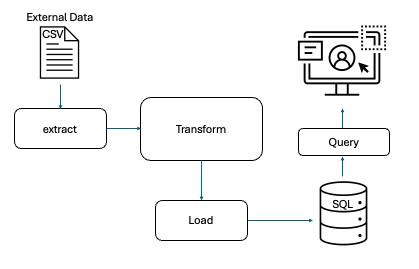

# IDS-706 Data Engineering Assignment
## Mini Project 5 : Python Script interacting with SQL Database

#### Status(CI/CD) badge

------
### Project Purpose

#### This project focuses on integrating Python scripting with SQL databases, allowing for efficient data manipulation and retrieval. The main objectives are to establish database connections, perform CRUD (Create, Read, Update, Delete) operations, and execute various SQL queries.
-----

### Requirements
The project structure must include the following files:

* ***Connect to a SQL database*** 
* ***Perform CRUD operations*** 
* ***Write at least two different SQL queries***

---------
### Dataset
File name : [HR.csv](HR.csv) 
 - The data used in this project originally comes from IBM. For reusability, I imported this from my last project [Link](https://raw.githubusercontent.com/nogibjj/Mini_PJT_3_Polars_ISL/refs/heads/main/HR.csv)

----------
### Summary
In this project, I developed a workflow pipeline that integrates an external data source with an SQLite database, enabling the execution of SQL queries through a Python script. The SQL queries perform the four essential operations typically carried out on a database or data repository: Create, Read, Update, and Delete (CRUD).

### Structure
CRUD operation [Link](query.py)
- Create(`queryCreate`) : This function creates a new table named `HR` in the SQLite database. The inserted values are as follows: `Age = 30`, `Attrition= Yes`, `BusinessTravel = Travel_Rarely`, and so on
- Read(`queryRead`) : This function retrieves all records from the `HR` table. It reads the data from the database.
- Update(`queryUpdate`) : This function updates the record with `id = 1` in the `HR` table. It checks if any of the fields are `NULL` or empty and replaces them with the value `9999999` to clean missing values.
- Delete(`queryDelete`) : This function deletes the record with `id = 3` from the `HR` table.

### Test errors and check format
- Format `make format`
- Lint `make lint`
- Test `make test`

### Database connection_SQL test
##