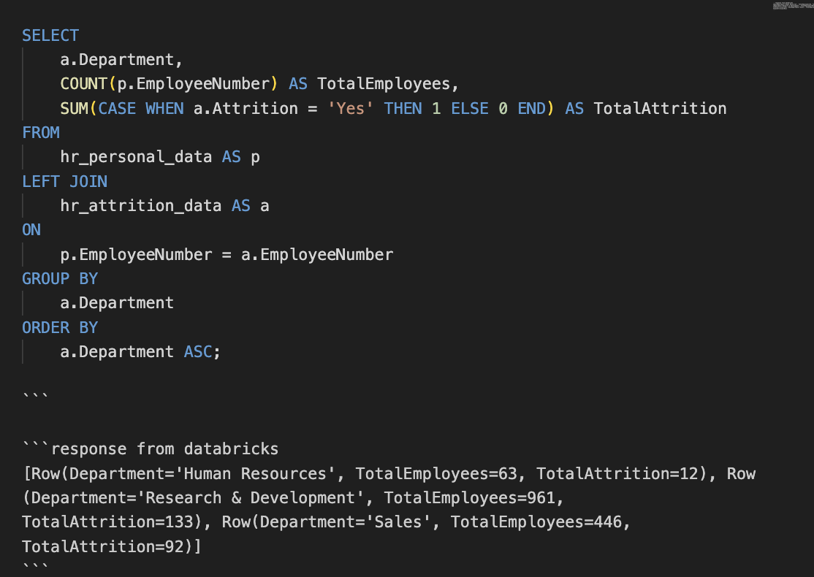
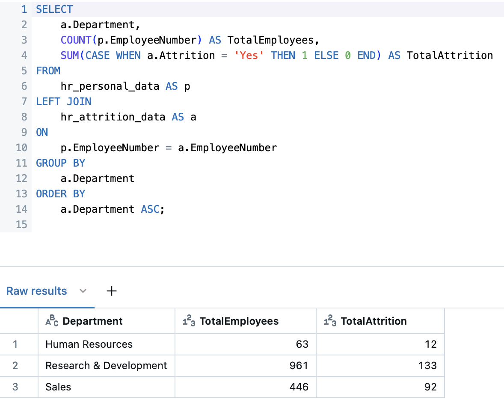

# IDS-706 Data Engineering Assignment
## Mini Project 6 : Complex SQL Query for a MySQL Database (Databricks)

#### Status(CI/CD) badge  [](https://github.com/nogibjj/Mini_PJT_6_Complex-SQL-Query-for-a-MySQL-Database/actions/workflows/CICD.yml)
------

### Project Purpose 

- The goal of this project is to build an Extract, Transform, Load (ETL), and Query pipeline using Python and Databricks.

- The project involves importing human resource-related data from an external source, extracting specific columns, separating the data into two files, establishing a connection to Databricks, and running SQL queries to perform joins, aggregations, and sorting operations.

-----

### Requirements

* ***Design a complex SQL query involving joins, aggregation, and sorting***
* ***Provide an explanation for what the query is doing and the expected results***

### Deliverables

* ***SQL query***
* ***Written explanation of the query***

---------
### Original Dataset
File name : [HR_1.csv](HR_1.csv), [HR_2.csv](HR_2.csv) save in data_raw folder
 - The data used in this project originlly come from IBM.  

----------
### Extract & Transform & Query
* Extract : The process retrieves two datasets(`HR_1.csv`, `HR_2.csv`) from an external source.

    - The `extract` function downloads two CSV files from specified URLs and saves them locally as HR_1.csv and HR_2.csv. To save computatinoal efficiency, only 8 out of the 35 total columns are selected and saved. If the process succeeds.

* Transform : This step extracts the necessary columns and uploads the data to the Databricks SQL Warehouse.

    - The `df_personal_data` DataFrame contains the columns "EmployeeNumber," "Age," "Gender," and "Education.", while the `df_attrition_data` DataFrame includes "EmployeeNumber," "Department," "JobRole," and "Attrition." Both DataFrames consist of 4 columns with 1,471 rows each.

    - Using the `sql.connect()` method, the script connects to Databricks SQL Warehouse with a unique token and creates the two tables(`hr_attrition_data`,`hr_personal_data`). EmployeeNumber is defined as the unique index in both tables.


* Query : The SQL query performs `joins`, `aggregation`, and `sorting` operations on the data stored in Databricks, and logs the results using the `log_query` function in the `query_log.md` file.

    - Specifically, `LEFT JOIN` merges two tables `hr_personal_data` and `hr_attrition_data`, using the EmployeeNumber field. This operation keeps all records from `hr_personal_data` based on the EmployeeNumber.
    
    - The `COUNT` clause counts the total number of employees in each department by counting the number of EmployeeNumber entries. The `SUM` calculates the total number employees who resigned in each department by checking if Attrition field is 'Yes' and adding 1 for each occurence.

    - `GROUP BY` groups the results by department, summarizing the total number of employees and attrition cases for each department. Finally, the results are sorted alphabetically by departments name using `ORDER BY`. The detailed SQL query and the final table created are shown in the image below.
        
        [Query log]
        

        [Query output]
        

### File structure
```
Mini_PJT_6_Complex-SQL-Query-for-a-MySQL-Database
├─ .devcontainer
│  ├─ Dockerfile
│  └─ devcontainer.json
├─ .github
│  └─ workflows
│     └─ CICD.yml
├─ HR_1.csv
├─ HR_2.csv
├─ Makefile
├─ README.md
├─ data_raw
│  ├─ HR_1.csv
│  └─ HR_2.csv
├─ main.py
│  ├─ extract.py
│  ├─ query.py
│  └─ transform.py
├─ query_log.md
├─ query_log_image.png
├─ requirements.txt
└─ test_main.py

```