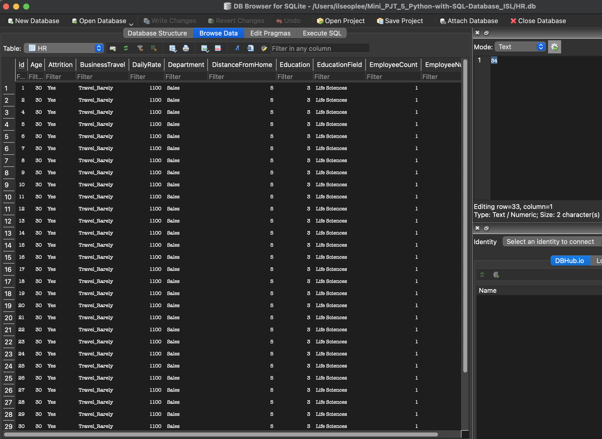

# IDS-706 Data Engineering Assignment
## Mini Project 6 : Complex SQL Query for a MySQL Database (Databricks)

#### Status(CI/CD) badge
[](https://github.com/nogibjj/Mini_PJT_6_Complex-SQL-Query-for-a-MySQL-Database/actions/workflows/CICD.yml)
------

### Project Purpose TBD

#### This project focuses on i
-----

### Requirements

* ***Design a complex SQL query involving joins, aggregation, and sorting***
* ***Provide an explanation for what the query is doing and the expected results***


---------
### Dataset
File name : [HR_1.csv](HR_1.csv), [HR_2.csv](HR_2.csv) save in data_raw folder
 - The data used in this project originally comes from IBM. For reusability, I imported this from my last project [Link](https://raw.githubusercontent.com/nogibjj/Mini_PJT_3_Polars_ISL/refs/heads/main/HR.csv)

----------
### Query
* extract and transform : HR_1.csv -> ['EmployeeNumber', 'Age', 'Gender', 'Education']-> hr_personal_data.csv -> 
HR_2.csv -> ['EmployeeNumber', 'Department', 'JobRole', 'Attrition']

* query : 
(1) Join : merging two data sets, employeenumber column is index 
(2) Aggregation : If attrition is Yes, count
(3) Sort : sorting by departments name       


### Structure
CRUD operation [Link](query.py)
- Create(`queryCreate`) : This function creates a new table named `HR` in the SQLite database. The inserted values are as follows: `Age = 30`, `Attrition= Yes`, `BusinessTravel = Travel_Rarely`, and so on
- Read(`queryRead`) : This function retrieves all records from the `HR` table. It reads the data from the database.
- Update(`queryUpdate`) : This function updates the record with `id = 1` in the `HR` table. It checks if any of the fields are `NULL` or empty and replaces them with the value `9999999` to clean missing values.
- Delete(`queryDelete`) : This function deletes the record with `id = 3` from the `HR` table.

### Test errors and check format
- Format `make format`
- Lint `make lint`
- Test `make test`


### Database connection_SQL test
##
```
Mini_PJT_6_Complex-SQL-Query-for-a-MySQL-Database
├─ .devcontainer
│  ├─ Dockerfile
│  └─ devcontainer.json
├─ .github
│  └─ workflows
│     └─ CICD.yml
├─ HR_1.csv
├─ HR_2.csv
├─ Makefile
├─ README.md
├─ data
├─ data_raw
│  ├─ HR_1.csv
│  └─ HR_2.csv
├─ main.py
│  ├─ extract.py
│  ├─ query.py
│  ├─ query_log.md
│  └─ transform.py
├─ query_log.md
├─ query_log_image.png
├─ requirements.txt
├─ results.json
└─ test_main.py

```